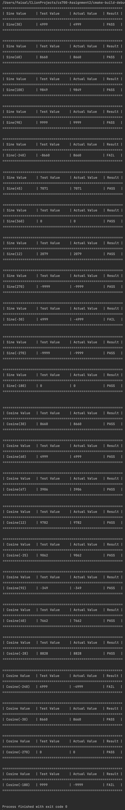

@mainpage

## Getting Started
#### This assignment contains 2 programs one to calculate the execution time for sorting an array and the other one to do white box testing for sine and cosine values. The program contains the following: 

### 1. Main file containing both modules.
### Contents -
1. main.cpp
### Usage - 
#### Running the main() function will run both the modules.
 
### 2. Module 1 - Execution time for sorting random, sorted and reversed arrays.
#### Contents - 
1. arraySorting.cpp (methods and variables are documented in class file not in cpp)
2. arraySorting.h
### Usage - 
#### Running this program to calculate the execution time for sorting random, sorted and reversed arrays. Results are generated on Apple Macbook Air M1 
### Output - 
1. Console output
      
  
### 3. Module 2 - White box testing of sines and cosines.
#### Contents - 
1. sin_cos.cpp
2. sin_cos.h
### Usage - 
#### Running this program will test sine/cosine functions with different values using whitebox testing.
### Output - 
1. Console output
      
