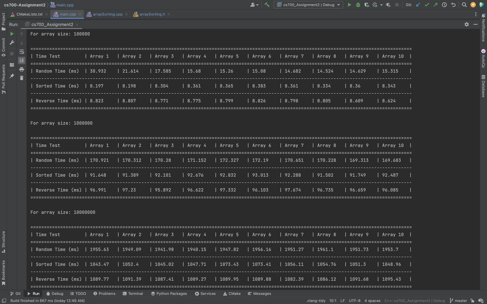

# CS-700 Assignment 2

## Getting Started
#### This assignment contains 2 programs one to calculate the execution time for sorting an array and the other one to do white box testing for sine and cosine values. The program contains the following: 

### 1. Main file containing both modules.
### Contents -
1. [Main CPP File](main.cpp)
### Usage - 
#### Running the main() function will run both the modules.
  
### 2. Module 1 - Execution time for sorting random, sorted and reversed arrays.
#### Contents - 
1. [Array Sorting Execution Time Section 1 CPP File](arraySorting.cpp)
2. [Array Sorting Execution Time Section 1 Header File](arraySorting.h)
### Usage - 
#### Running this program to calculate the execution time for sorting random, sorted and reversed arrays.
### Output - 
1. Console output
      

  
### 3. Module 2 - White box testing of sines and cosines.
#### Contents - 
1. [Grades Section 2 CPP File](grades_section2.cpp)
2. [Grades Section 2 Header File](grades_section2.h)
### Usage - 
#### Running this program will test sine/cosine functions with different values using whitebox testing.
### Output - 
1. Console output
      
